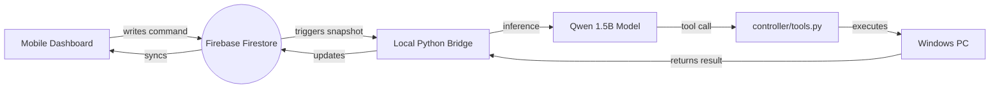

# 🕷️ Spider-Arm Assistant

A local, agentic AI assistant powered by **Qwen2.5-1.5B (Fine-Tuned)** with real-time PC control capabilities and a premium mobile remote dashboard. Optimized for consumer GPUs (RTX 3050 4GB).


## 🚀 Features

-   **PC Control**: Launch apps, type text, take screenshots, and manage processes via natural language.
-   **Agentic Reasoning**: Uses a fine-tuned Qwen model to "think" before acting.
-   **Remote Dashboard**: A glassmorphism mobile UI to control your PC from anywhere in the world.
-   **Cloud Messaging**: Synchronized via Firebase Firestore for low-latency command execution.
-   **Safety First**: Built-in approval loop for sensitive actions like file deletion.

## 🏗️ Architecture



## 🛠️ Tech Stack

-   **Model**: [unsloth/Qwen2.5-1.5B-Instruct-bnb-4bit](https://github.com/unslothai/unsloth)
-   **Inference**: Accelerating via Unsloth (4-bit LoRA)
-   **Backend**: Python 3.12 (venv_312)
-   **Database**: Google Firebase Firestore
-   **UI**: Vanilla HTML/JS with Glassmorphism CSS

## 📋 Prerequisites

-   Windows 10/11
-   NVIDIA GPU (4GB+ VRAM recommended)
-   Python 3.12
-   Firebase Account & Project

## 🔧 Installation

1. **Clone the Repo**:
   ```powershell
   git clone https://github.com/your-username/Spider-Arm-Assistant.git
   cd Spider-Arm-Assistant
   ```

2. **Setup Virtual Environment**:
   ```powershell
   python -m venv venv_312
   .\venv_312\Scripts\activate
   pip install torch unsloth psutil pyautogui firebase-admin
   ```

3. **Configure Firebase**:
   - Place your `serviceAccountKey.json` in the project root.
   - Update `mobile/index.html` with your Firebase Web Config.

4. **Prepare Data (Optional)**:
   ```powershell
   python scripts/generate_synthetic_data.py
   python train.py
   ```

## 🎮 Usage

### 🏠 Local Terminal Mode
Run the assistant directly in your terminal:
```powershell
python inference.py
```

### 📱 Remote Bridge Mode
Start the link between your PC and the Mobile Dashboard:
```powershell
python -m backend.firebase_bridge
```

## 🛡️ Tools & Safety

The agent has access to the following tools:
- `screenshot()`: Captures the primary display.
- `launch_app(name)`: Opens any installed application.
- `get_system_info(metric)`: Fetches CPU, RAM, or Disk stats.
- `type_text(text)`: Simulates keyboard input.
- `terminate_process(name)`: Force closes applications.
- `delete_file(path)`: **[REQUIRES REMOTE APPROVAL]**

## 📜 License
MIT License. Explore and build!
