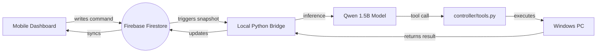

# 🕷️ Spider-Arm Assistant v2.5 (Zero-Touch Edition)

A professional, local agentic AI assistant powered by **Qwen2.5-1.5B (Fine-Tuned LoRA)**. Spider-Arm provides real-time PC control, hardware monitoring, and high-precision app launching through a premium, "Spider-Themed" mobile remote dashboard. 

---

## 🌟 What's New in v2.5
- **Spider Theme**: A complete UI overhaul with a high-contrast Red & Black "Spider" aesthetic.
- **Smart App Launcher**: Prioritizes Brave/Chrome shortcuts and handles Windows aliases (like Calculator) without error popups.
- **Hardware Heat Monitor**: Real-time GPU (RTX 3050) and CPU temperature telemetry.
- **Universal Media Controls**: Remote Play/Pause, Skip, and Volume control for Spotify, YouTube, and more.
- **JSON Repair Layer**: Enhanced model reliability for small 1.5B parameters.

## 🚀 Core Features
- **Safety First**: Built-in approval loop for sensitive actions like file deletion.

## 🛡️ Security & Privacy
Spider-Arm v2.5 is designed for personal privacy:
- **Google Authentication**: The mobile dashboard is locked. Only the owner can send commands.
- **Firestore Lockdown**: Security Rules ensure that only your verified email can write to the database.
- **Local Inference**: Your AI brain runs 100% locally on your GPU. No private screen captures are sent to external APIs.

## 🌟 Detailed Features
- **🕷️ Hardware Pulse**: Real-time telemetry for **NVIDIA GPU** & **CPU** temperatures.
- **🎯 Smart App Launcher**: Prioritizes Brave shortcuts and handles Windows command aliases.
- **🎵 Universal Media Control**: Remote Play/Pause, Skip, and Volume for Spotify/YouTube.
- **🤖 JSON Repair Layer**: Auto-corrects minor model formatting errors for 100% reliability.

## 🏗️ Architecture



## 🛠️ Tech Stack
- **Model**: [unsloth/Qwen2.5-1.5B-Instruct-bnb-4bit](https://github.com/unslothai/unsloth)
- **Inference**: Accelerating via Unsloth (4-bit LoRA)
- **Backend**: Python 3.12 (venv_312)
- **Database**: Google Firebase Firestore
- **UI**: Vanilla HTML/JS with Glassmorphism CSS

---

## ⚡ Quick-Start: Zero-Touch Setup (v2.5) 🚀

The **Spider-Setup v2.5** handles the heavy lifting, but you'll need the core engine ready first.

### 📋 Phase 1: Prerequisites (The Essentials)
Open your **terminal** and run these "One-Click" commands:

**1. Install Python 3.12.10** (Exact Version):
```powershell
winget install -e --id Python.Python.3.12 --version 3.12.10
```
*(⚠️ Important: During manual install, you **MUST** check the **'Add to PATH'** box!)*

**2. Install Firebase CLI**:
```powershell
npm install -g firebase-tools
```

---

### 🛠️ Phase 2: Local Environment
```powershell
# 1. Grab the code
git clone https://github.com/Mayan-kr/Spider-Arm-Assistant.git
cd Spider-Arm-Assistant

# 2. Create your isolated environment
python -m venv venv_312
.\venv_312\Scripts\activate
```

---

### 🕷️ Phase 3: The "Architect" Wizard
Run the wizard to build your entire Cloud Infrastructure automatically:
```powershell
python setup_wizard.py
```

**⚠️ Watch your browser for these 3 "Security Clicks":**
1. **Firebase Login**: Log in to your Google Account when the browser pops up.
2. **Enable Auth**: The wizard will open the **Firebase Console**. Click **"Enable Google Sign-In"** and Save. (Required for dashboard security).
3. **Generate Private Key**: The wizard will open the **Service Accounts** page. Click **"Generate New Private Key"**, then open the downloaded JSON and paste its content into the terminal.

---

### 📱 Phase 4: Remote Operation
Once the wizard prints your **Unique URL**, you are ready:
1. **Start the Pulse**: Run `python -m backend.firebase_bridge` on your PC.
2. **Go Mobile**: Open your project URL on your phone and enjoy!

---

## 🎮 Assistant Modes

### 🏠 Local Terminal Mode
For direct PC control without the cloud:
```powershell
python inference.py
```

### 📱 Remote Bridge Mode (Hybrid)
Connects your PC to the world. Ensure this is running to receive mobile commands:
```powershell
python -m backend.firebase_bridge
```

## 🛡️ Tools & Safety
The agent has access to the following tools:
- `screenshot()`: Captures the primary display.
- `launch_app(name)`: Opens any installed application.
- `get_system_info(metric)`: Fetches CPU, RAM, or Disk stats.
- `type_text(text)`: Simulates keyboard input.
- `terminate_process(name)`: Force closes applications.
- `delete_file(path)`: **[REQUIRES REMOTE APPROVAL]**

## 📜 License
MIT License. Explore and build!
