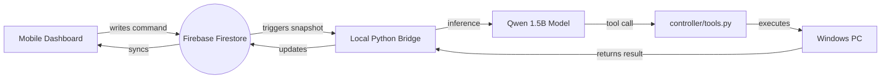

# 🕷️ Spider-Arm Assistant v2.0

A professional, local agentic AI assistant powered by **Qwen2.5-1.5B (Fine-Tuned LoRA)**. Spider-Arm provides real-time PC control, hardware monitoring, and high-precision app launching through a premium, "Spider-Themed" mobile remote dashboard. 

<!--  -->

## 🌟 What's New in v2.0
-   **Spider Theme**: A complete UI overhaul with a high-contrast Red & Black "Spider" aesthetic.
-   **Smart App Launcher**: Prioritizes Brave/Chrome shortcuts and handles Windows aliases (like Calculator) without error popups.
-   **Hardware Heat Monitor**: Real-time GPU (RTX 3050) and CPU temperature telemetry.
-   **Universal Media Controls**: Remote Play/Pause, Skip, and Volume control for Spotify, YouTube, and more.
-   **JSON Repair Layer**: Enhanced model reliability for small 1.5B parameters.

## 🚀 Core Features
-   **Safety First**: Built-in approval loop for sensitive actions like file deletion.

## 🛡️ Security & Privacy
Spider-Arm v2.0 is designed for personal privacy:
-   **Google Authentication**: The mobile dashboard is locked. Only the owner can send commands.
-   **Firestore Lockdown**: Security Rules ensure that only your verified email can write to the database.
-   **Local Inference**: Your AI brain runs 100% locally on your GPU. No private screen captures are sent to external APIs.

## 🌟 Detailed Features
-   **🕷️ Hardware Pulse**: Real-time telemetry for **NVIDIA GPU** & **CPU** temperatures.
-   **🎯 Smart App Launcher**: Prioritizes Brave shortcuts and handles Windows command aliases.
-   **🎵 Universal Media Control**: Remote Play/Pause, Skip, and Volume for Spotify/YouTube.
-   **🤖 JSON Repair Layer**: Auto-corrects minor model formatting errors for 100% reliability.

## 🏗️ Architecture



## 🛠️ Tech Stack

-   **Model**: [unsloth/Qwen2.5-1.5B-Instruct-bnb-4bit](https://github.com/unslothai/unsloth)
-   **Inference**: Accelerating via Unsloth (4-bit LoRA)
-   **Backend**: Python 3.12 (venv_312)
-   **Database**: Google Firebase Firestore
-   **UI**: Vanilla HTML/JS with Glassmorphism CSS

## 📋 Prerequisites

-   Windows 10/11
-   NVIDIA GPU (4GB+ VRAM recommended)
-   Python 3.12
-   Firebase Account & Project

## 🔧 Quick Start (The Easy Way)

If you are cloning this repository, you don't need to manually edit files. We've built an **Automated Setup Wizard** to do the heavy lifting for you.

### 1. Ready the Environment
```powershell
python -m venv venv_312
.\venv_312\Scripts\activate
```

### 2. Run the Wizard
```powershell
python setup_wizard.py
```
**What the wizard does for you:**
-   ✅ Installs all dependencies (`torch`, `unsloth`, `pyautogui`, etc.)
-   ✅ Asks for your Firebase keys and injects them into the Dashboard.
-   ✅ Sets your authorized email for the Security Lockdown.
-   ✅ **Awakens the Brain**: Automatically runs the training process to create your local AI model.

---

## 🎮 Post-Setup Usage
Once the wizard finishes, your Spider-Arm is ready to go:

### 🏠 Local Control
```powershell
python inference.py
```

### 📱 Remote Control (Android)
1.  **Deploy**: `firebase deploy`
2.  **Start Bridge**: `python -m backend.firebase_bridge`
3.  **Open URL**: Go to your hosted Firebase URL on your phone and Sign In!

## 🎮 Usage

### 🏠 Local Terminal Mode
Run the assistant directly in your terminal:
```powershell
python inference.py
```

### 📱 Remote Bridge Mode
Start the link between your PC and the Mobile Dashboard:
```powershell
python -m backend.firebase_bridge
```

## 🛡️ Tools & Safety

The agent has access to the following tools:
- `screenshot()`: Captures the primary display.
- `launch_app(name)`: Opens any installed application.
- `get_system_info(metric)`: Fetches CPU, RAM, or Disk stats.
- `type_text(text)`: Simulates keyboard input.
- `terminate_process(name)`: Force closes applications.
- `delete_file(path)`: **[REQUIRES REMOTE APPROVAL]**

## 📜 License
MIT License. Explore and build!
